# Space Travel Website
A Space Travel website built with HTML, CSS, and JavaScript
- This is the companion project of the course [Build a space travel website](https://scrimba.com/learn/spacetravel) by Kevin Powell
- I've added new features to the original project as well as improve its UI
- This website is responsive
- See the [origional challenge](https://www.frontendmentor.io/challenges/space-tourism-multipage-website-gRWj1URZ3) on [Frontend Mentor](https://www.frontendmentor.io/home)

### Home page demos

  <td>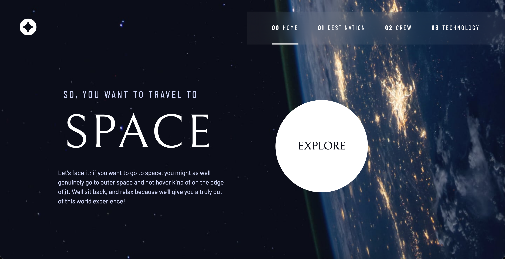</td>

<table>
  <tr>
    <td>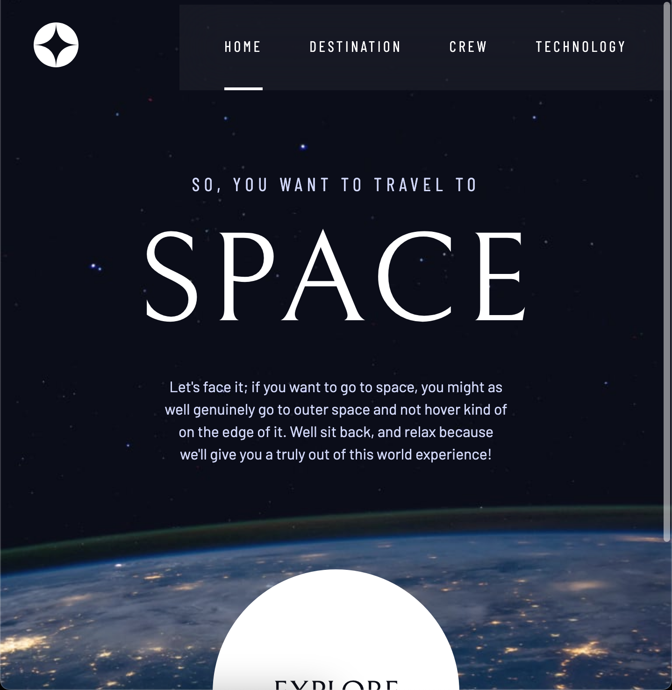</td>
    <td>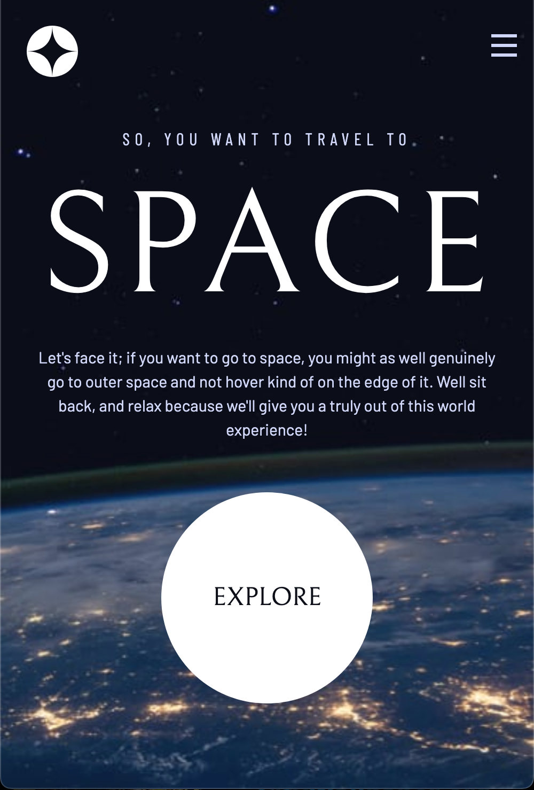</td>
  </tr>
 </table>

### Destination page demos

  <td>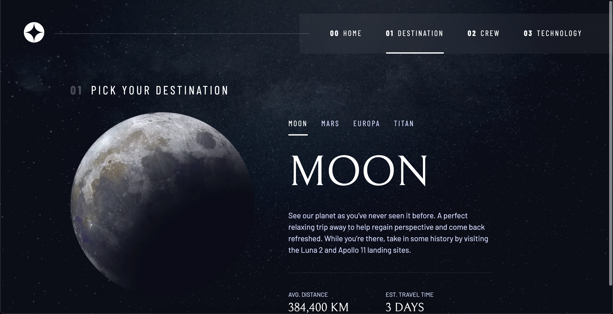</td>

<table>
  <tr>
    <td>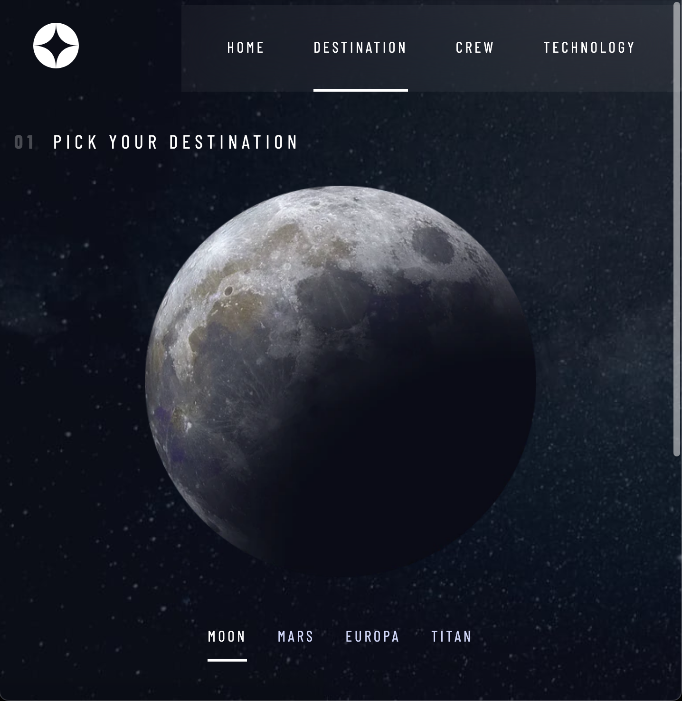</td>
    <td></td>
  </tr>
 </table>

### Crew page demos

  <td>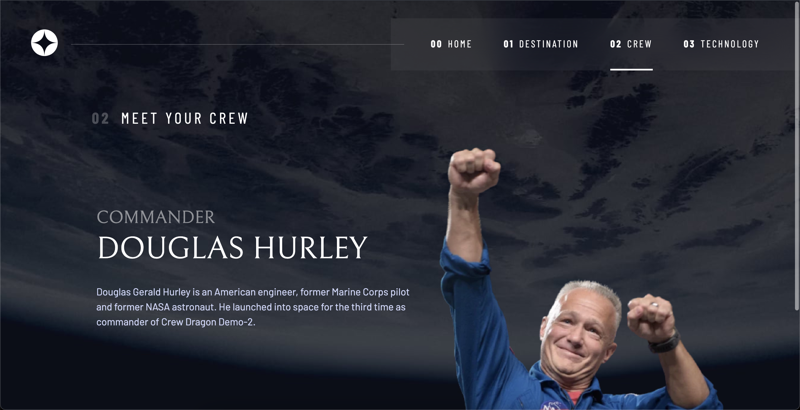</td>

<table>
  <tr>
    <td>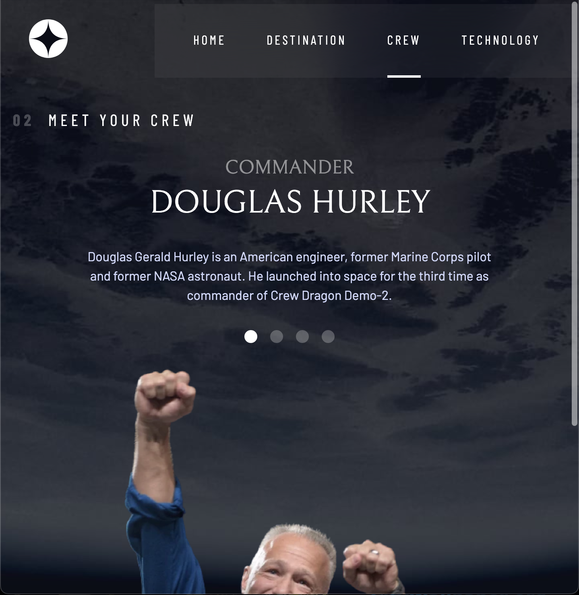</td>
    <td>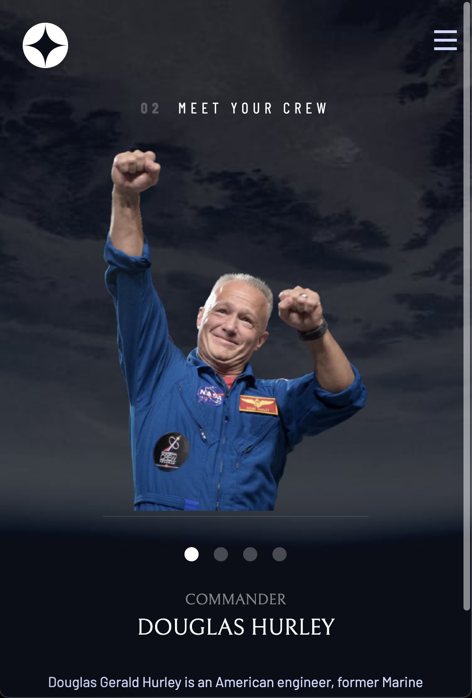</td>
  </tr>
 </table>

### Technology page demos

  <td>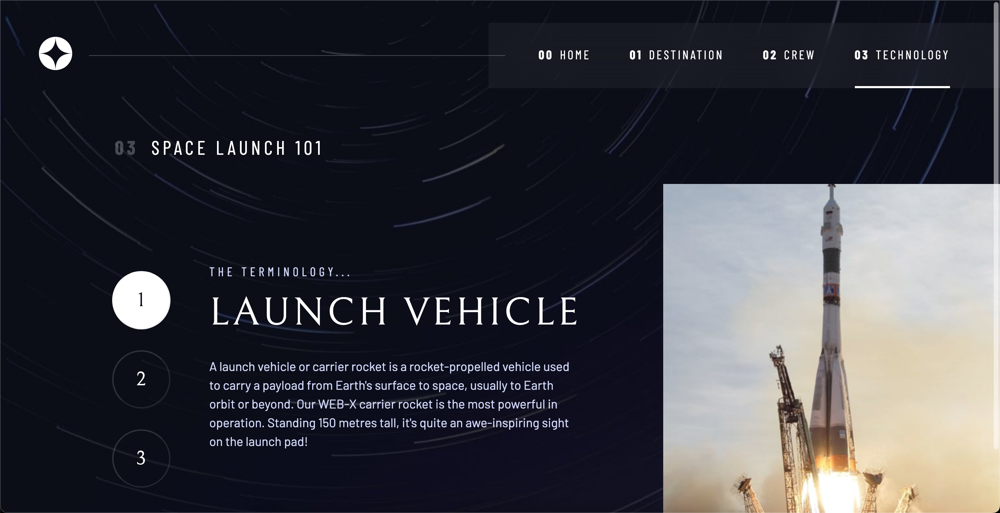</td>

<table>
  <tr>
    <td>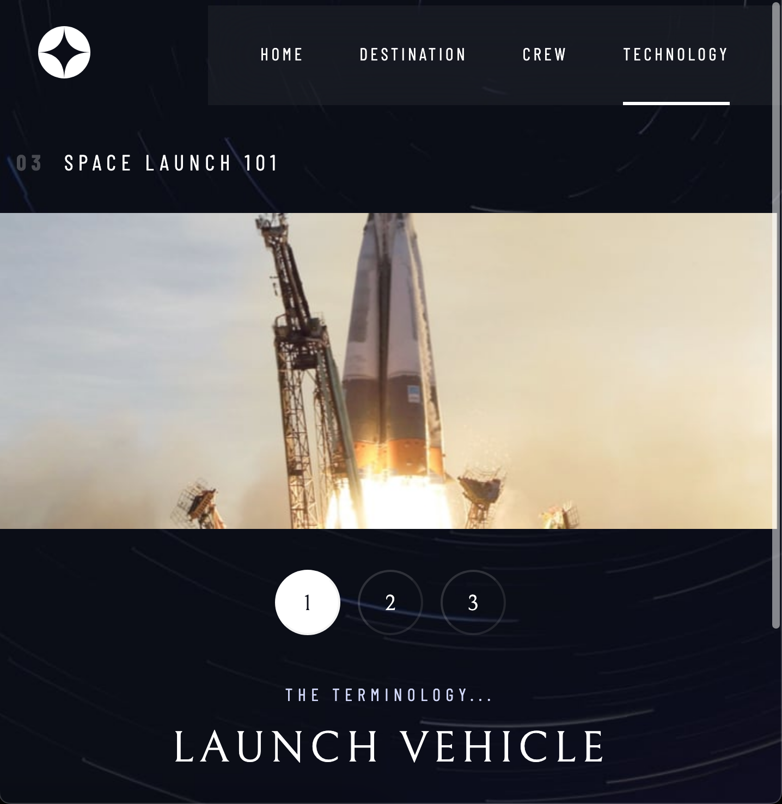</td>
    <td>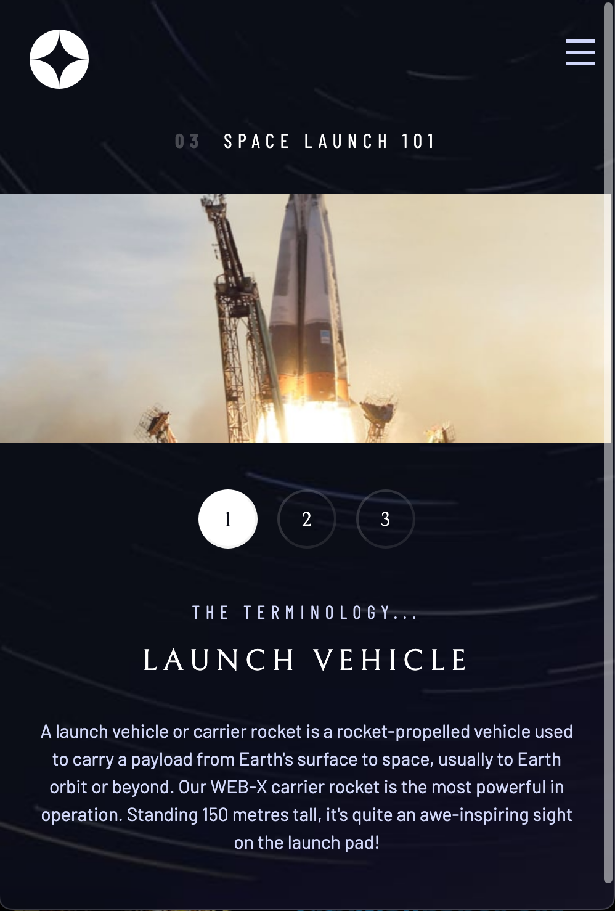</td>
  </tr>
 </table>

## Some topics covered in this project
- `Utility classes`
  - Do one thing, and do it very well
  - Often only have one declaration, but they can have multiple when required
  - Allow things to be much more modular, and allow us to write a lot less in the long run
- Advantages of `RGB` & `HSL`
  - If we store the `RGB` or `HSL` values in a custom property, it makes it really easy to tweak the alpha value when needed.
- Finding the right balance
  - Utility classes let us work quickly
  - BUT, when we have something like our numbered titles that is always the same, it can be a good idea to find a balance
- Adding the spacing
  - Utility are very common (.m-1, .m-2, etc.)
  - We don't really need that in this design, and we can use something else that will speed things up
- Interactive elements
  - The explore button
  - Underlined indicators
  - Dot indicators
  - Number indicators
- To-do
  - Research scrollbar-gutter
  - Add page transition effects
- Responsive implementing order
  - Mobilde
  - Tablet (`@media (min-width: 35rem)`)
  - Desktop (`@media (min-width: 45rem)`)